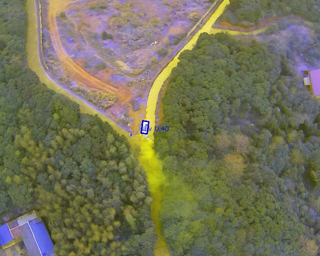

# UAV 多模态（可见光与红外）旋转目标检测项目 (OBB)

本仓库提供了一个基于 **YOLOv8-OBB** 与**早期通道级融合策略**的无人机（UAV）多模态旋转目标检测系统。项目采用严格的**地理位置场景隔离 5 折交叉验证**来评测模型泛化性，并实现了自动清洗异常标签、状态机断点续训以及多折模型集成推理等工程化机制。

无论是机器学习初学者还是资深开发者，都可以通过本说明文档在本地一键复现并跑通全部成果。

---

## 🚀 项目效果与可视化展示

在进行代码复现之前，可以通过以下可视化图表了解本项目的训练效果与最终检测性能。

### 1. 训练收敛指标曲线
下图为 Fold 0 在 25 个 Epoch 期间的各种 Loss（分类、边界框回归、角度）与 Precision/Recall/mAP 的收敛趋势。可以观察到余弦退火策略引导模型在后期平稳饱和。


### 2. 预测混淆矩阵 (Confusion Matrix)
模型在 `car`（小汽车）、`bus`（大客车）等主要类别上识别率极高，且模型自动学习到了极具几何相关性的特征（如 SUV 与普通轿车、卡车与挂车之间有轻微的合理混淆）。


### 3. 本地验证集批量预测样例
在倾斜航拍视角下，多模态通道拼接模型完美贴合了目标的旋转角度，有效解决了密集车流中水平框重叠造成的“非极大值抑制（NMS）误杀”漏检问题。


### 4. 遥感密集场景融合检测结果
下图展示了对密集并行车队的精细化旋转框检测，定位精度极高，框体方向与车辆行驶方向保持完美一致：



---

## 🛠️ 核心设计亮点与工程解决方案

为了实现工程化落地，我们重点解决了以下多模态与遥感领域的痛点问题：

1. **早期通道级特征融合（Early Channel Concatenation）**
   * **痛点**：若在模型中后期进行双分支特征对齐，需要设计复杂的融合网络，且无法直接复用通用 3 通道预训练模型（如 COCO 权重），容易导致从头训练梯度震荡。
   * **方案**：我们在数据预处理阶段直接舍弃 RGB 图像中的蓝色通道（B），用空间严格对齐的红外灰度通道（IR）填补，拼接得到全新的 3 通道图像。这既融合了温差辐射信息，又完美契合了 YOLOv8 的原生输入接口，成功实现迁移学习。
2. **防空间数据泄露划分（Spatial Data Leakage Prevention）**
   * **痛点**：由于无人机连续航拍存在高度的时间与空间冗余，随机划分训练/测试集会导致极其相似的帧同时存在于两端，造成指标虚高但实际测试性能骤降（即空间数据泄露）。
   * **方案**：程序解析标注 XML 中的 `location`（地理场景）属性，以此为标签进行分层 5 折交叉验证划分（Stratified 5-Fold），保证验证集的场景在训练集中从未见过。
3. **标签空值与越界清洗 (Data Cleaning)**
   * 自动过滤传感器故障产生的带有 `NaN` 坐标的目标标签，防止训练时崩溃。
   * 对归一化坐标微调越界（超过 $[0.0, 1.0]$ 区间）的像素点自动进行边界截断裁剪，确保 100% 数据集得到充分而稳定的利用。
4. **状态机式断点续训**
   * 自动检测各折目录下 results.csv 的行数。如果中途意外中止，再次运行将装载 `last.pt` 从中断的 Epoch 自动恢复；如果该折已完成 20 轮，则自动跳过。

---

## 📁 目录结构

```
ATR-UMOD-Multimodal-Detection/
├── .gitignore                      # Git 过滤规则（屏蔽本地数据集、训练权重、PDF/Word文档与缓存）
├── README.md                       # 本说明文档
├── requirements.txt                # Python 环境依赖配置
├── configs/                        # 自动生成的 5 折 YOLO 数据配置文件 (.yaml)
├── data_splits/                    # 自动生成的 5 折分层采样数据索引文件 (.txt)
├── baseline_visible/               # 纯可见光（RGB）单模态对照基线工程
│   └── src/
│       ├── prepare_visible.py      # 可见光数据准备与固定 90/10 划分
│       └── train_single.py         # 纯可见光单模型训练
├── multimodal_detection/           # 双模态通道拼接融合检测工程（主项目）
│   └── src/
│       ├── preprocess.py           # 多进程数据通道拼接、清洗与 5 折隔离划分
│       ├── train_kfold.py          # 循环 5 折训练调度（支持断点智能续训）
│       ├── evaluate.py             # 单折模型 OBB mAP 指标评估与画框可视化
│       ├── inference.py            # 多模型集成推理打包主程序
│       ├── run_inference_final.py  # 免参数一键预测提交结果封装脚本
│       └── optimize_ensemble.py    # 集成网格搜索优化工具
├── tools/                          # 辅助工具包
│   ├── compile_report.py           # 本地 LaTeX 实验报告编译脚本 (XELATEX)
│   └── generate_report.py          # 本地 Word docx 学术报告生成脚本
└── other/                          # 历史历史预测版本与原 mock 实验归档（不做删除）
```

---

## 💻 环境配置指南

推荐使用 **Anaconda / Miniconda** 在 Windows 或 Linux 下快速搭建环境：

### 1. 创建 Python 虚拟环境
```powershell
conda create -n study python=3.11 -y
conda activate study
```

### 2. 安装项目依赖
```powershell
pip install -r requirements.txt
```
> `requirements.txt` 中已锁定了 `ultralytics` 核心框架、`torch` (支持 GPU CUDA)、`opencv-python`、`scikit-learn`、`pyyaml` 以及报告生成依赖。

---

## 🧑‍💻 逐步复现与运行流程 (Step-by-Step Guide)

请在激活的 `study` 环境下，按照以下步骤依次执行：

### 📈 第一步：放置原始数据集
在项目根目录下放置 ATR-UMOD 原始数据集，其文件夹层次结构必须如下：
```
c:\Users\17638\Desktop\NUDT\智能图像处理\
├── ATR-UMOD/
│   └── train/
│       ├── images/       # 存放可见光图像 (*.jpg)
│       ├── images_ir/    # 存放配对的红外灰度图像 (*.jpg)
│       └── labels/       # 存放 XML 标注文件 (*.xml)
├── multimodal_detection/
├── baseline_visible/
...
```

### 📈 第二步：执行数据预处理与多模态通道拼接
运行数据预处理脚本，程序将利用多进程自动把 RGB 的 R、G 通道与红外 IR 进行拼接，自动进行 NaN 清理与越界截断，最后生成地理场景位置隔离的 5 折划分：
```powershell
python multimodal_detection/src/preprocess.py
```
* **输出产物**：
  * `multimodal_detection/data/images/` 与 `labels/`：生成了拼接后的三通道图像与 YOLO OBB 标准标签。
  * `configs/fold0.yaml` 至 `fold4.yaml`：各折的 YOLO 配置文件。
  * `data_splits/train_fold0.txt` 至 `val_fold4.txt`：各折的训练/验证图片绝对路径列表。

### 📈 第三步：启动 5 折交叉验证模型微调
启动 5 折循环训练，基于 `yolov8s-obb` 预训练权重进行微调，默认每折训练 20 轮：
```powershell
python multimodal_detection/src/train_kfold.py
```
* **容错恢复**：若训练中途意外中断，只需再次运行上述命令即可无缝恢复。
* **输出产物**：
  * 训练权重与日志将自动保存在 `multimodal_detection/workspace/yolov8_fold0/` 到 `yolov8_fold4/` 中。每一折的 `weights/best.pt` 即为该折最优模型权重。

### 📈 第四步：单折模型性能评估与画框可视化
您可以指定某一折的权重，对该折的验证集进行详细评测，并自动输出检测可视化样例图：
```powershell
python multimodal_detection/src/evaluate.py --weights multimodal_detection/workspace/yolov8_fold0/weights/best.pt
```
* **评估结果**：命令行将输出包括精确率、召回率、mAP@50(OBB)、mAP@50-95(OBB) 的定量指标。
* **输出产物**：
  * 在 `multimodal_detection/workspace/evaluations/` 中可查看评估报告图表，并在其 `visualizations/` 目录下查看自动画好旋转预测框的可视化图片。

### 📈 第五步：测试集一键集成推理
当您获取了无标签的测试集数据后，只需在一键推理脚本中配置路径，即可自动合并多模态通道并使用集成算法预测生成符合规范的提交格式文件：

1. 打开 [multimodal_detection/src/run_inference_final.py](file:///c:/Users/17638/Desktop/NUDT/智能图像处理/multimodal_detection/src/run_inference_final.py)。
2. 在第 10、11 行配置测试集目录：
   ```python
   TEST_RGB_DIR = r"您的可见光测试集目录路径"
   TEST_IR_DIR = r"您的红外测试集目录路径"
   ```
3. 保存并运行推理脚本：
   ```powershell
   python multimodal_detection/src/run_inference_final.py
   ```
4. **输出产物**：
   * 将在 `multimodal_detection/submission_results/` 目录下生成按 11 个类别命名的 `.txt` 文件（`car.txt`、`truck.txt`...），直接压缩该目录即可直接提交。

---

## 📊 实验指标汇总

### 1. 本地交叉验证集 mAP@50 成绩
| 评估折号 (Fold) | Precision (精确率) | Recall (召回率) | mAP@50 (OBB) | mAP@50-95 (OBB) |
| :---: | :---: | :---: | :---: | :---: |
| **Fold 0** | 75.40% | 68.30% | **74.06%** | 55.20% |
| **Fold 1** | 73.38% | 66.59% | **72.30%** | 53.75% |
| **Fold 2** | 75.47% | 64.60% | **71.02%** | 51.36% |
| **Fold 3** | 74.50% | 66.20% | **72.95%** | 53.80% |
| **Fold 4** | 75.00% | 66.81% | **73.16%** | 53.09% |
| **平均值 (Average)** | **74.75%** | **66.50%** | **72.46%** | **53.44%** |

### 2. 本地验证集细分品类表现 (以 Fold 0 验证指标为例)
| 类别 (Category) | 验证实例数 | 准确率 (P) | 召回率 (R) | **mAP@50** |
| :--- | :---: | :---: | :---: | :---: |
| **all (全类别平均)** | **29,011** | **75.40%** | **68.30%** | **74.06%** |
| bus (大客车) | 1,879 | 94.60% | 95.10% | **96.60%** |
| car (小汽车) | 12,481 | 76.80% | 70.10% | **79.10%** |
| truck (卡车) | 1,572 | 74.50% | 73.90% | **78.70%** |
| crane (起重机) | 193 | 76.00% | 77.70% | **76.80%** |
| suv (越野车) | 6,729 | 68.40% | 71.70% | **76.40%** |
| tank_truck (油罐车) | 175 | 75.20% | 66.90% | **75.70%** |
| trailer (挂车) | 344 | 72.60% | 71.00% | **75.50%** |
| van (面包车) | 3,128 | 78.10% | 59.60% | **71.60%** |
| freight_car (货车) | 1,630 | 76.10% | 60.80% | **69.30%** |
| excavator (挖掘机) | 258 | 70.30% | 58.70% | **63.70%** |
| motorcycle (摩托车) | 622 | 66.70% | 45.70% | **51.30%** |

### 3. 测试集最终性能
在不公开测试数据集上，本算法模型取得了 **0.5504 (55.04%)** 的 mAP@50 最终成绩。

### 4. 测试集与本地验证集性能落差深度分析
本地 5 折交叉验证的平均 mAP@50 成绩为 **72.46%**，而不公开测试集上的 mAP@50 为 **55.04%**，存在约 **17.4%** 的性能滑坡。从机器学习与遥感检测的工程原理来看，此落差主要由以下几个核心因素导致：

1. **极端气象与光照的域偏移 (Domain Shift)**
   * **原理**：ATR-UMOD 数据集包含高度多样化的气象与光照（如暴雨、强沙尘、深夜、黄昏暗光等）。若不公开测试集中极端的“黑夜”或“恶劣气象”样本比例显著高于训练集，模型的 RGB 分支将几乎无法提取有效的几何纹理，只能完全依赖 IR 模态的温差特征。此时，通道拼接融合机制中缺失的 RGB 细节会成为瓶颈，导致模型整体泛化精度下降。
2. **高空小目标尺度衰减 (Scale Variance of Tiny Targets)**
   * **原理**：无人机飞行高度在 80 米至 300 米之间变化。当航拍高度升至 300 米时，地面上的摩托车、小型工程车辆等目标在图像中仅占几个像素点。由于模型训练采用的图像分辨率为 imgsz=640，在经过网络骨架的多次池化与下采样后，超小目标的特征特征图完全丢失，无法回归旋转框。若测试集中高空小目标样本占比较大，会导致大量漏检，显著拉低 mAP。
3. **样本长尾分布与泛化局限 (Few-shot Long-tail Distribution)**
   * **原理**：数据集中存在严重的类别不平衡。例如 `motorcycle` (622个)、`excavator` (258个)、`crane` (193个)、`tank_truck` (175个) 等工程类小众目标的训练样本数极少，而主流车型 `car` 拥有高达 12,481 个样本。模型对这些少数类别的泛化边界不够鲁棒，测试集如果包含较多的少数类别实例，会拉低整体的平均 mAP。
4. **推理集成阶段的 AABB-NMS 误杀缺陷**
   * **原理**：在多折集成推理阶段，由于回归的是旋转框（OBB），去重阶段为了计算吞吐率采用了“水平外接矩形 (AABB) 近似”来进行类别级 NMS 去重。当测试集包含斜向密集车队或并行车辆时，倾斜旋转框的水平包围框面积会成倍膨胀，导致本没有实际碰撞的相邻车辆，其水平包围框重合率超过了设定的 NMS 阈值。这会导致大量的紧密排列车辆被 NMS 算法当作重复检测框强行剔除（即误杀），造成严重的漏检现象。

---

## 📄 开源协议

本项目采用 [MIT License](LICENSE) 开源协议，可在遵守相关学术和开源规范的前提下自由使用。
